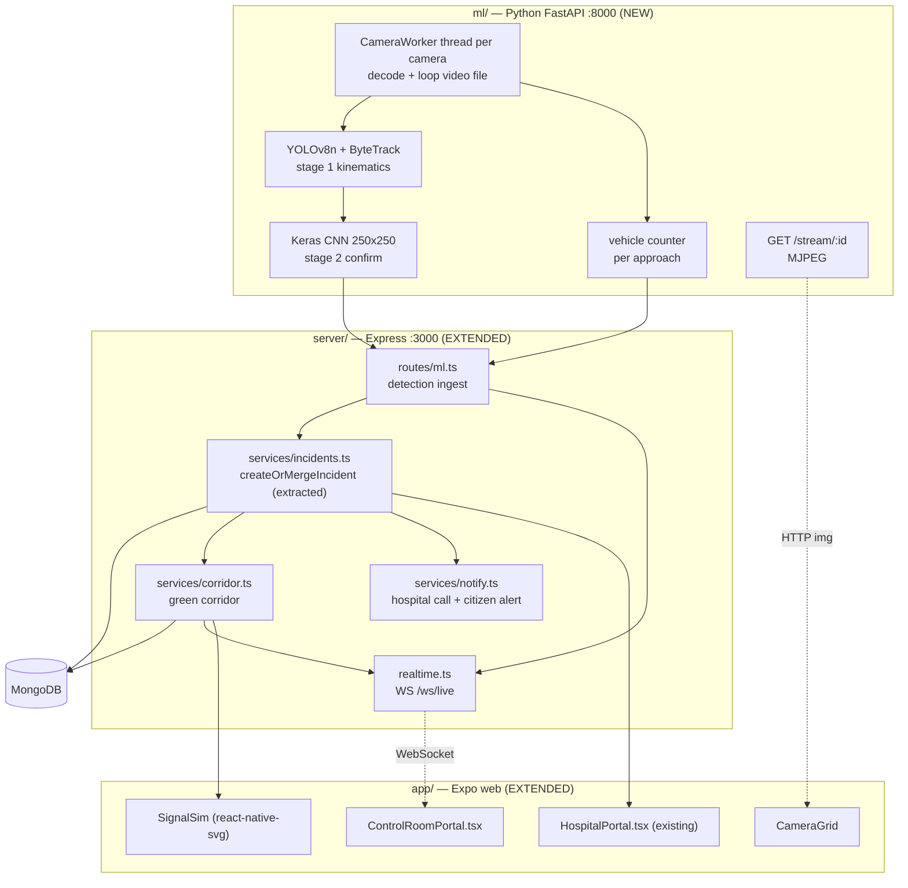

# Golden Hour — AI Accident Detection + Smart Traffic Management
## Implementation Specification (build document)

> **Read this entire file before writing a single line of code.**
> This spec is written to be executed top-to-bottom. Every phase ends with a
> verification gate. Do not start phase N+1 until phase N's gate passes.
>
> Sections marked **VERIFIED** contain facts confirmed by direct inspection of
> the source repositories and this codebase on 2026-09-20. Treat them as
> ground truth and do not re-derive, re-guess, or "improve" them.

---

# 0. Ground rules (anti-drift contract)

These rules exist because the two features below touch a working emergency
system. Breaking `POST /api/sos` breaks the product.

### 0.1 Hard constraints

1. **Do not modify the behaviour of any existing endpoint.** You will refactor
   `POST /api/sos` internals exactly once (Phase 2.3). Its request body,
   response shape, status codes, and log output must remain byte-identical.
2. **The existing test suite must pass after every phase.**
   `npm --prefix server test` — 5 files, 24 tests. If your change makes a test
   fail, your change is wrong; do not edit the test to match.
3. **`npm --prefix server run typecheck` and `npm --prefix app run typecheck`
   must both pass after every phase.** No `any`, no `@ts-ignore` to get past a
   type error. The codebase is strict TypeScript with explicit return types —
   match that style.
4. **Do not add npm dependencies to `app/` that are not listed in Phase 5.1.**
   The dashboard is built from `react-native-svg` (already installed) and
   plain DOM elements. No map library, no chart library, no canvas library.
5. **No Python code in `server/`. No TypeScript in `ml/`.** The boundary
   between them is HTTP + JSON only, defined in Phase 2.1.
6. **Never invent a model file.** If a weights file does not exist on disk, the
   code must fail loudly at startup with a message naming the missing path —
   never silently fall back to random weights or a stub that returns a
   hardcoded confidence.
7. **One phase, one commit.** Commit message format: `feat(ml): phase 3 — ...`.

### 0.2 Style rules observed in this codebase (match them)

- Files open with a banner comment:
  `// ====...` / `// SAMARITAN SHIELD — <Title>` / short rationale / `// ====...`
- Comments explain *why a decision was made*, not what the line does. See
  `server/models/HospitalStaff.ts` and the `POST /api/sos` preamble for the
  house voice. Do not write `// loop over cameras`.
- Mongoose schemas use explicit validator messages:
  `required: [true, 'Hospital ID is required']`.
- Server responses are always `{ status: 'success' | 'error', ... }`.
- Console logging uses the emoji prefixes already in use: `✅` success,
  `❌` error, `🚨` incident, `━━━` separators around incident blocks.

---

# 1. What the reference repositories actually contain

**Read this section carefully. Both repositories are far thinner than their
READMEs claim.** An agent that assumes the READMEs are accurate will waste
hours looking for files that do not exist.

### 1.1 `Soham2212004/Road-Accident-Detection-Alert-System` — **VERIFIED**

Entire repository is 5 code/data files: `main.py`, `camera.py`, `detection.py`,
`model.json`, `test_video.mp4`, plus `LICENSE` and `README.md`.

| Claim | Reality |
|---|---|
| "Install dependencies listed in the requirements file" | `requirements.txt` contains **two sentences of prose about Twilio**. It is not a requirements file. There is no dependency list anywhere in the repo. |
| Working accident model | `model.json` is **architecture only**. The weights file `model_weights.keras` that `detection.py` loads is **not in the repository.** The README says "For Dataset and inquiries, contact Soham Soni". **You cannot download working weights. Do not look for them.** |
| Cross-platform | `camera.py` imports `winsound` — **Windows-only**, will `ImportError` on macOS/Linux immediately. |
| Production-shaped | The alert UI is `tkinter` spawned on a daemon thread; `call_ambulance()` has Twilio credentials as literal placeholder strings; `gif_path = ""` will throw; the video path is the literal string `"test_video_path"`. |
| Continuous detection | `alarm_triggered` is a module global set to `True` on first detection and **never reset**, so the process detects exactly one accident, ever. |

**What IS usable from this repo:** the CNN topology in `model.json`, and the
overall idea (classify a resized RGB ROI per frame, threshold the softmax
probability, act above threshold). That is all. Reproduced exactly:

```
Input        (250, 250, 3)      # camera.py resizes to 250x250, RGB, adds batch axis
BatchNormalization
Conv2D(32,  (3,3), relu) -> MaxPooling2D((2,2))
Conv2D(64,  (3,3), relu) -> MaxPooling2D((2,2))
Conv2D(128, (3,3), relu) -> MaxPooling2D((2,2))
Conv2D(256, (3,3), relu) -> MaxPooling2D((2,2))
Flatten
Dense(512, relu)
Dense(2, softmax)

class_nums = ['Accident', 'No Accident']    # index 0 = Accident
```

Note the class order: **index 0 is "Accident"**. Getting this backwards is the
single easiest way to build a detector that fires on empty roads. Assert it.

### 1.2 `shubham001official/Smart-Adaptive-Traffic-Management-System` — **VERIFIED**

Entire repository is 3 standalone scripts (`vehicle_detection.py`,
`green_time_signal.py`, `cctv_image_capture.py`), `setup.md`, `README.md`,
`LICENSE`. **There is no YOLO v8 code, no GUI, no simulation, and no video in
this repository** despite all four being claimed in the README.

| Claim | Reality |
|---|---|
| "YOLO v8 object detection" | `vehicle_detection.py` calls `cv2.dnn.readNet("yolov3.weights", "yolov3.cfg")` — **YOLOv3 via OpenCV DNN**. `setup.md` separately says YOLOv4. Neither weights file is in the repo. |
| "Admin GUI", "Simulation Demo" | **No such files exist.** The README embeds video filenames that were never committed. |
| Scripts form a pipeline | They do not. `vehicle_detection.py` reads a hardcoded image path and shows a window. `green_time_signal.py` reads an integer from `vehicle_count.txt`. Nothing writes that file. |
| Runnable | `vehicle_detection.py` calls `np.argmax` but **never imports numpy** — it crashes on the first detection. `setup.md` tells you to run `traffic_signal.py`, which does not exist. |
| Detects vehicles | Filters on `class_id == 2` only, i.e. **cars only**. In Indian traffic this ignores motorcycles, buses, autos and trucks — the majority of vehicles. |

**What IS usable from this repo:** exactly one formula, from
`green_time_signal.py`. Reproduce it faithfully and then clamp it:

```
base_green_time   = 30      # seconds
vehicle_multiplier = 2      # seconds added per vehicle
green_time = base_green_time + (vehicle_count * vehicle_multiplier)
```

We will use this as `adaptiveGreenSeconds`, clamped to `[15, 90]` (the raw
formula gives 130s for 50 vehicles, which starves cross traffic).

### 1.3 Consequences for the plan

Because there are no usable pretrained accident weights, the detector is
**two-stage** (this was chosen deliberately, not as a workaround):

- **Stage 1 — YOLOv8 + track kinematics.** Works on day one with off-the-shelf
  COCO weights. No dataset, no training. Produces a continuous 0–1 score.
- **Stage 2 — the CNN above, trained by us.** Confirms stage-1 candidates to
  suppress false positives. Until it is trained, the pipeline runs stage 1
  only, at a higher threshold, and reports `stage2: null`.

The system must be fully functional and demoable with stage 2 absent.

---

# 2. Target architecture



### New file inventory

```
ml/                                   NEW — Python service
├── main.py                           FastAPI app + lifespan
├── config.py                         env reader
├── bridge.py                         HTTP client -> Node /api/ml/*
├── cameras.py                        CameraWorker (thread per camera)
├── accident/
│   ├── tracker.py                    YOLOv8 + ByteTrack, per-track state
│   ├── heuristics.py                 stage 1 scoring
│   ├── classifier.py                 stage 2 CNN wrapper
│   └── pipeline.py                   fusion + debounce + event emit
├── traffic/counter.py                per-approach vehicle counts
├── train/build_model.py              CNN architecture (section 1.1)
├── train/train_cnn.py                training script
├── models/                           weights land here (gitignored)
├── data/videos/                      demo footage (gitignored)
├── cameras.seed.json                 virtual camera registry
└── requirements.txt

server/
├── models/Camera.ts                  NEW
├── models/TrafficSignal.ts           NEW
├── models/GreenCorridor.ts           NEW
├── models/ControlRoomStaff.ts        NEW
├── models/DetectionEvent.ts          NEW
├── routes/ml.ts                      NEW
├── routes/control.ts                 NEW
├── routes/traffic.ts                 NEW
├── services/incidents.ts             NEW (extracted from server.ts)
├── services/corridor.ts              NEW
├── services/notify.ts                NEW
├── middleware/serviceAuth.ts         NEW
├── realtime.ts                       NEW
├── scripts/seed-city.ts              NEW
└── tests/ml.test.ts, corridor.test.ts, incidents.test.ts   NEW

app/
├── ControlRoomPortal.tsx             NEW
└── control/
    ├── CameraGrid.tsx                NEW
    ├── IncidentTicker.tsx            NEW
    ├── CityMap.tsx                   NEW (react-native-svg)
    ├── SignalSim.tsx                 NEW (react-native-svg)
    └── liveSocket.ts                 NEW (WS client)
```

---

# 3. Phase-by-phase build

## Phase 1 — Data models and the third role

**No ML, no Python. Pure schema + auth work. Lowest-risk starting point.**

### 1.1 New Mongoose models

Follow `server/models/Hospital.ts` exactly for file shape, banner comment
style, validator messages, and the `Model<I…>` export pattern.

**`models/Camera.ts`**
```ts
cameraId: string    // unique, indexed, e.g. 'JAI-CAM-014'
name: string        // 'Tonk Road / Gandhi Circle — North approach'
zone: string        // 'Jaipur South'
location: { type: 'Point', coordinates: [lng, lat] }   // 2dsphere index
source: string      // file path relative to ml/data/videos, or an rtsp:// URL
approach?: string   // 'N' | 'S' | 'E' | 'W' — which signal arm this watches
signalId?: string   // FK -> TrafficSignal.signalId
status: 'ONLINE' | 'OFFLINE' | 'DEGRADED'   // default OFFLINE
lastFrameAt?: Date
enabled: boolean    // default true
```
Index: `{ location: '2dsphere' }`.

The `source` field accepts either a file path or a stream URL. For this build
every camera is a looping video file, but nothing in the code may assume that
— `cameras.py` branches on `source.startswith(('rtsp://','http://','https://'))`.

**`models/TrafficSignal.ts`**
```ts
signalId: string    // unique, indexed, 'JAI-SIG-007'
name: string
location: { type: 'Point', coordinates: [lng, lat] }   // 2dsphere
approaches: ['N','S','E','W']
currentPhase: { approach: string, state: 'GREEN'|'YELLOW'|'RED', endsAt: Date }
adaptiveGreenSeconds: number   // default 30, from the reference formula
lastVehicleCounts: { N: number, S: number, E: number, W: number }
preemption?: {
  corridorId: string
  approach: string     // arm the ambulance enters from
  holdFrom: Date
  holdUntil: Date
}
mode: 'ADAPTIVE' | 'PREEMPTED' | 'MANUAL'   // default ADAPTIVE
```

**`models/GreenCorridor.ts`**
```ts
incidentId: string           // indexed
status: 'ACTIVE' | 'CLEARED' | 'EXPIRED'
originHospitalId?: string
routeGeometry: { type: 'LineString', coordinates: [number,number][] }
totalDistanceKm: number
baselineEtaMinutes: number      // OSRM duration, no pre-emption
optimisedEtaMinutes: number     // with pre-emption applied
signals: [{
  signalId: string
  sequenceIndex: number
  distanceAlongRouteKm: number
  etaSeconds: number            // from corridor open to ambulance arrival
  approach: string
  preemptedAt?: Date
  clearedAt?: Date
}]
openedAt: Date
clearedAt?: Date
```

**`models/DetectionEvent.ts`** — the raw ML audit trail, separate from
`Incident` so a low-confidence detection is recorded without creating an
emergency.
```ts
cameraId: string          // indexed
kind: 'ACCIDENT' | 'TRAFFIC_COUNT'
stage1Score: number
stage2Score?: number      // null until the CNN is trained
fusedConfidence: number
escalated: boolean        // did this create/merge an Incident?
incidentId?: string
snapshotBase64?: string   // JPEG of the triggering frame
detectedAt: Date          // indexed, descending
```

**`models/ControlRoomStaff.ts`** — a direct structural copy of
`models/HospitalStaff.ts` (email PK, lowercase, unique, indexed) with
`zone: string` instead of `hospitalId`/`hospitalName`. Collection:
`control_room_staff`.

### 1.2 The `control_room` role

`server/models/User.ts`:
```ts
export type UserRole = 'citizen' | 'hospital' | 'control_room';
```
Update the schema `enum` array to match. Add optional `zone?: string`.

Add a 2dsphere-indexed location so nearby-citizen alerting (Phase 8) can use a
spatial query — `lastKnownLat` / `lastKnownLng` are scalars and cannot be
`$near`-queried. **Keep both**; do not remove the scalar fields, other code
reads them.
```ts
lastLocation?: { type: 'Point', coordinates: [number, number] }
// UserSchema.index({ lastLocation: '2dsphere' });
```

`server/server.ts`, in `POST /api/auth/sync` (around line 360–375): the role
resolution block currently checks `HospitalStaff` only. Extend it, preserving
the existing precedence comment and the "an existing role is preserved" rule:

```ts
let role: UserRole = existing?.role && existing.role !== 'citizen' ? existing.role : 'citizen';
// ... existing HospitalStaff check unchanged ...
if (role === 'citizen') {
  const control = await ControlRoomStaff.findOne({ email: email.toLowerCase() }).lean();
  if (control) { role = 'control_room'; zone = control.zone; }
}
```
Also set `lastLocation` in the `$set` block when `lat`/`lng` are present.

`server/middleware/auth.ts`: add `requireControlRoom`, an exact copy of
`requireHospital` with `user.role !== 'control_room'` and the message
`'Control room access required.'`.

### 1.3 Seed script

`server/scripts/seed-city.ts`, modelled on the existing
`scripts/seed-hospital-staff.ts`. Seeds:
- 6 `Camera` documents at real Jaipur junctions (Tonk Road/Gandhi Circle,
  Ajmer Road/200 Ft Bypass, JLN Marg/Trauma Centre, Sikar Road/Collectorate,
  MI Road/Panch Batti, Ring Road/Sitapura) with real coordinates.
- 4 `TrafficSignal` documents, cameras linked via `signalId` + `approach`.
- 1 `ControlRoomStaff` entry from `argv[2]`.

Add `"seed:city": "ts-node scripts/seed-city.ts"` to `server/package.json`.

> ### GATE 1
> - `npm --prefix server run typecheck` clean
> - `npm --prefix server test` — 24/24 still pass
> - `npm --prefix server run seed:city -- you@example.com` populates all
>   three collections; verify in `mongosh`
> - Logging in as that email returns `role: 'control_room'` from
>   `POST /api/auth/sync`

---

## Phase 2 — Server ingestion layer

### 2.1 The ML↔Node contract (freeze this; both sides implement it)

Authentication: a shared secret, **not** Firebase. New
`server/middleware/serviceAuth.ts` compares the `X-Service-Token` header
against `process.env.ML_SERVICE_TOKEN` using `crypto.timingSafeEqual`. If
`ML_SERVICE_TOKEN` is unset the server **refuses to start** — same posture as
`initAuth()` in `middleware/auth.ts`, which exits rather than silently
allowing unauthenticated access. Reuse that pattern and its warning-box style.

```
GET  /api/ml/cameras            X-Service-Token
  -> { status:'success', cameras: [{ cameraId, name, source, location:{lat,lng},
                                     zone, approach, signalId }] }

POST /api/ml/detection          X-Service-Token
  <- { cameraId: string,
       stage1Score: number,          // 0..1
       stage2Score: number | null,   // null when the CNN is unavailable
       fusedConfidence: number,      // 0..1
       snapshotBase64: string,       // JPEG, no data: prefix, <= 400 KB
       detectedAt: string }          // ISO 8601
  -> { status:'success', escalated: boolean, incidentId?: string, detectionId: string }

POST /api/ml/traffic            X-Service-Token
  <- { cameraId, counts: { car, motorcycle, bus, truck }, total, observedAt }
  -> { status:'success', adaptiveGreenSeconds: number }

POST /api/ml/heartbeat          X-Service-Token
  <- { cameraId, status: 'ONLINE'|'DEGRADED', fps: number }
  -> { status:'success' }
```

`snapshotBase64` size: enforce with `express.json({ limit: '2mb' })` on the
`/api/ml` router **only** — do not raise the global body limit set at
`server.ts:330`.

### 2.2 Escalation rule (server-side, not ML-side)

The ML service reports; **the server decides**. Put this in `routes/ml.ts`:

| `fusedConfidence` | Action |
|---|---|
| `< 0.55` | Write `DetectionEvent` only. No broadcast. |
| `0.55 – 0.79` | Write `DetectionEvent`, broadcast `detection-candidate` to the control room for human confirmation. **No incident.** |
| `>= 0.80` | Write `DetectionEvent`, auto-escalate: create/merge an `Incident`, notify hospital, alert nearby citizens, open a green corridor. |

Plus a **per-camera cooldown of 90 seconds** on auto-escalation, to stop one
crash producing forty incidents. Store it in memory (`Map<cameraId, number>`);
this does not need to survive a restart.

Manual escalation path for the 0.55–0.79 band:
`POST /api/control/detections/:id/escalate` (`requireControlRoom`) runs the
identical escalation function.

### 2.3 The one refactor: extract `createOrMergeIncident`

This is the highest-risk change in the project. Read
`server/server.ts` lines 428–556 (`POST /api/sos`) before touching anything.

Create `server/services/incidents.ts` and move the body of the handler into:

```ts
export type IncidentSource = 'CITIZEN_SOS' | 'CCTV_AI';

export interface CreateIncidentInput {
  lat: number;
  lng: number;
  reporterId: string;          // firebase uid, or `cctv:<cameraId>` for AI
  source: IncidentSource;
  cameraId?: string;
  aiConfidence?: number;
  snapshotBase64?: string;
}

export async function createOrMergeIncident(
  input: CreateIncidentInput
): Promise<{
  incident: IIncident;
  role: ReporterRole;
  certificate: ICertificateRecord;
  primaryHospital: HospitalInfo | null;
  backupHospitals: HospitalInfo[];
  merged: boolean;
  message: string;
}>
```

**Preserve exactly, in order:** the coordinate validation, the
server-authoritative ISO timestamp, the SHA-256 digest over
`` `${reporterId}|${lat}|${lng}|${timestamp}` ``, the single
`getNearestHospitals()` call whose result is reused for both record and
response, the `$near` dedup against `DEDUP_RADIUS_METERS`, the
secondary-reporter append, the "don't mint a second certificate for the same
reporter" guard, and the `━━━` log block.

`POST /api/sos` then becomes a thin wrapper: validate, call
`createOrMergeIncident({ ...body, reporterId: req.user!.uid, source: 'CITIZEN_SOS' })`,
render the PDF, respond with the **same JSON keys and the same
`existingIncident ? 200 : 201` status**.

Add to `models/Incident.ts`:
```ts
source: 'CITIZEN_SOS' | 'CCTV_AI'     // default 'CITIZEN_SOS'
detectedByCameraId?: string
aiConfidence?: number
snapshotBase64?: string
```
Defaulting `source` means every existing document and every existing test
keeps working unchanged.

> **Certificates and AI incidents.** An AI-detected incident has no human
> reporter, so it must **not** mint a certificate at creation
> (`certificates: []`). When a real citizen later presses SOS at that
> location, the normal dedup path merges them in and issues *their*
> certificate. Preserving this is the whole point of the Good Samaritan
> feature — do not let the camera claim the reward.

### 2.4 Realtime channel

`server/realtime.ts`. A second `WebSocketServer` on the **same HTTP server** at
path `/ws/live`. Do not touch `signaling.ts` or its `/ws` path — VoIP has a
passing test (`tests/voip.test.ts`) asserting zero phone-number leakage.

```ts
export function initLiveChannel(httpServer: HttpServer): {
  broadcast(topic: LiveTopic, payload: unknown): void;
  broadcastToUsers(uids: string[], topic: LiveTopic, payload: unknown): void;
}

type LiveTopic =
  | 'detection-candidate'   // 0.55-0.79 band, control room only
  | 'incident-created'      // auto-escalated
  | 'incident-updated'
  | 'camera-status'
  | 'signal-state'          // per-signal phase change
  | 'corridor-opened'
  | 'corridor-progress'
  | 'corridor-cleared'
  | 'citizen-alert';        // targeted, nearby users only

// client -> server, first message:
// { type: 'subscribe', token: '<bearer, same format as api.ts>', role: 'control_room'|'citizen'|'hospital' }
```

Verify the token through the same path `requireAuth` uses, including the
`insecure-dev` `uid:email` form — otherwise local development cannot connect.
Reject unauthenticated sockets. **Only `control_room` sockets receive
`detection-candidate` and camera snapshots**; citizens receive only
`citizen-alert` messages addressed to them.

Wire it in `startServer()` next to the existing `initVoipSignaling(httpServer)`
call (around `server.ts:1452`).

> ### GATE 2
> - 24/24 existing tests pass, **unmodified**
> - New `tests/incidents.test.ts` proves `createOrMergeIncident` produces an
>   identical hash and dedup result to the pre-refactor handler
> - `curl -X POST localhost:3000/api/ml/detection` without `X-Service-Token`
>   returns 401
> - A `fusedConfidence: 0.9` POST creates an `Incident` with
>   `source: 'CCTV_AI'` and `certificates: []`
> - A second POST from the same camera 10s later is rejected by the cooldown

---

## Phase 3 — Python ML service, stage 1

### 3.1 Pin these versions exactly (`ml/requirements.txt`)

```
fastapi==0.115.6
uvicorn[standard]==0.34.0
ultralytics==8.3.55
opencv-python-headless==4.10.0.84
numpy==1.26.4
httpx==0.28.1
pydantic==2.10.4
pydantic-settings==2.7.0
python-dotenv==1.0.1
```
CNN-only (Phase 4), kept separate in `ml/requirements-train.txt`:
```
tensorflow==2.18.0
scikit-learn==1.6.0
```

`opencv-python-headless`, not `opencv-python` — the service must never try to
open a GUI window. Remove every trace of `cv2.imshow`, `cv2.waitKey`,
`tkinter`, and `winsound` you might be tempted to carry over from the
reference (see section 1.1).

Python 3.11. `numpy<2` because TensorFlow 2.18 and some ultralytics paths are
still unhappy on numpy 2.x.

### 3.2 `cameras.py` — one worker thread per camera

```python
class CameraWorker(threading.Thread):
    # - opens cv2.VideoCapture(source)
    # - file sources loop: on ret==False, cap.set(cv2.CAP_PROP_POS_FRAMES, 0)
    #   (the reference `break`s and exits — we must not)
    # - throttles to TARGET_FPS (default 12) with a sleep, so 6 cameras do not
    #   saturate the CPU
    # - keeps the newest raw frame in self.latest_frame under a lock, for MJPEG
    # - runs inference on every Nth frame (INFER_EVERY_N, default 3)
    # - posts a heartbeat every 10s
```

Never share a `cv2.VideoCapture` across threads. Never call `.read()` from the
MJPEG endpoint — it serves `latest_frame` only.

Shutdown: a `threading.Event` per worker, set from the FastAPI `lifespan`
teardown, joined with a 5s timeout. A leaked capture thread makes `uvicorn
--reload` unusable.

### 3.3 `accident/tracker.py` — YOLOv8 + ByteTrack

```python
model = YOLO('yolov8n.pt')            # auto-downloads on first run, ~6 MB
VEHICLE_CLASSES = {2: 'car', 3: 'motorcycle', 5: 'bus', 7: 'truck'}
PERSON_CLASS = 0
results = model.track(frame, persist=True, tracker='bytetrack.yaml',
                      classes=[0, 2, 3, 5, 7], conf=0.35, verbose=False)
```

Note `classes` includes motorcycles, buses and trucks — the reference filters
`class_id == 2` (cars only), which is wrong for Indian roads (section 1.2).

Maintain per-track-id a bounded `deque(maxlen=30)` of
`(timestamp, centroid_xy, bbox_wh)`. Derive per track:
- `speed_px_s` — centroid displacement / dt, smoothed over 5 frames
- `accel_px_s2` — first difference of speed
- `heading_delta_deg` — angle change between consecutive motion vectors
- `aspect_ratio` — `w / h`, and its delta over the window

**Normalise speed by bounding-box height** (`speed_px_s / bbox_h`) before
thresholding. Raw pixel speed is meaningless across cameras with different
zoom levels — this is the difference between a detector that transfers between
cameras and one that must be retuned per camera.

### 3.4 `accident/heuristics.py` — stage 1 score

Four signals, each producing 0–1, combined as a weighted sum:

| Signal | Weight | Fires when |
|---|---|---|
| `sudden_deceleration` | 0.35 | normalised speed drops > 65% within 0.5s while previously moving |
| `bbox_overlap` | 0.30 | IoU between two vehicle tracks > 0.15 **and** both were converging (closing distance) in the prior 1s |
| `abnormal_orientation` | 0.20 | `aspect_ratio` changes > 40% within 1s (a vehicle rolling or turning broadside) |
| `post_event_stillness` | 0.15 | a previously moving track is near-stationary for > 3s in a non-junction region |

`stage1Score = Σ(weight × signal)`, clipped to `[0, 1]`.

**Debounce:** the score must exceed the candidate threshold on **4 of the last
6 inference frames** before an event is emitted. A single-frame spike is a
tracker glitch, not a crash. This is the main defence against false positives
and must not be skipped.

Make every threshold a field on a `HeuristicConfig` pydantic model read from
env, so tuning does not require code edits.

### 3.5 `accident/pipeline.py` — fusion

```python
if stage2 is None:
    fused = stage1 * 0.85          # never auto-escalate on stage 1 alone at
                                   # full weight; caps a stage1=1.0 at 0.85
else:
    fused = 0.45 * stage1 + 0.55 * stage2
```

Note the consequence: with the CNN absent, a perfect stage-1 score reaches
0.85, which **does** clear the 0.80 auto-escalation bar — so the system is
demoable before Phase 4, but only on an unambiguous event. That is intended.

### 3.6 `bridge.py` and MJPEG

`bridge.py`: an `httpx.AsyncClient` with `X-Service-Token`, a 5s timeout, and
**retry-with-backoff that never blocks the capture loop** (fire onto an
`asyncio.Queue`, drain in a background task). If Node is down, log and drop —
a dead backend must not freeze the camera grid.

`GET /stream/{camera_id}` returns
`StreamingResponse(media_type='multipart/x-mixed-replace; boundary=frame')`,
yielding the worker's `latest_frame` JPEG-encoded at quality 70, ~10 fps, with
detection boxes drawn on. Also expose `GET /snapshot/{camera_id}.jpg` as the
fallback the dashboard uses if MJPEG misbehaves.

> ### GATE 3
> - `uvicorn main:app` starts, pulls 6 cameras from `/api/ml/cameras`, and all
>   report `ONLINE`
> - `http://localhost:8000/stream/JAI-CAM-014` opened directly in a browser
>   shows moving video with boxes
> - Ctrl-C shuts down cleanly with no orphaned threads
> - Playing real dashcam crash footage through one camera produces a
>   `POST /api/ml/detection` with `stage1Score > 0.7`
> - Playing 10 minutes of normal traffic produces **zero** escalations
>   (tune thresholds until this holds — this gate is not optional)

---

## Phase 4 — Stage 2 CNN

### 4.1 `train/build_model.py`

Reproduce the architecture from section 1.1 **exactly**, in that layer order.
The only permitted additions, each behind a flag defaulting to on:
`Dropout(0.3)` before the final `Dense(2)`, and `Rescaling(1./255)` after the
input. Do not swap in a ResNet/EfficientNet backbone — if you deviate from the
reference topology, the plan's provenance claim is void.

```python
model.compile(optimizer=Adam(1e-4),
              loss='categorical_crossentropy',
              metrics=['accuracy', tf.keras.metrics.Recall(class_id=0)])
```
Recall on class 0 (Accident) is the metric that matters. A missed crash costs
a life; a false positive costs a control-room operator ten seconds.

### 4.2 `train/train_cnn.py`

Dataset: Kaggle **"Accident Detection From CCTV Footage"**
(`ckay16/accident-detection-from-cctv-footage`) — pre-split `train/val/test`
with `Accident` / `Non Accident` folders. Print the download command; do not
attempt to auto-download behind a login.

- `image_dataset_from_directory`, `image_size=(250, 250)`,
  `class_names=['Accident', 'Non Accident']` — **pass `class_names`
  explicitly** so index 0 is Accident, matching the reference (section 1.1).
  Alphabetical ordering would give the same result here, but relying on that
  is how this bug ships.
- Augmentation: horizontal flip, ±10% brightness, ±5% rotation. **No vertical
  flip** — upside-down road scenes do not occur and teach the model nothing.
- `class_weight` to counter imbalance; `EarlyStopping(monitor='val_recall',
  mode='max', patience=8, restore_best_weights=True)`.
- Save to `ml/models/accident_cnn.keras`, and write
  `ml/models/accident_cnn.meta.json` with the class order, input shape,
  training date, and test-set recall/precision.

Then **print a calibration table** of precision/recall at thresholds
0.5/0.6/0.7/0.8/0.9 and pick `STAGE2_THRESHOLD` from it. Do not hardcode 0.5.

### 4.3 `accident/classifier.py`

- Loads `ml/models/accident_cnn.keras` at startup. **If the file is absent:
  log a clear one-line warning, set `self.available = False`, and return
  `None` from `predict()` forever.** Never fabricate a score. Never load
  random weights. (Ground rule 0.6.)
- On startup, if available, assert `meta.json` class order is
  `['Accident', ...]` and raise if not.
- Preprocessing must match training exactly: BGR→RGB, resize to 250×250,
  `float32`, rescale, `np.expand_dims(axis=0)`.
- Only runs on frames stage 1 flagged as candidates — never on every frame.
  This keeps the whole service comfortably real-time on CPU.

> ### GATE 4
> - `python train/build_model.py --summary` prints a layer table matching
>   section 1.1 exactly
> - Deleting `ml/models/accident_cnn.keras` and restarting: service boots,
>   logs the warning, and every detection carries `stage2Score: null`
> - With weights present: test-set recall on Accident ≥ 0.85, and the
>   10-minute normal-traffic run from Gate 3 still yields zero escalations

---

## Phase 5 — Control room dashboard

### 5.1 Dependencies

**None.** Everything below uses `react-native-svg` (already in
`app/package.json`), `react-native` primitives, and DOM ``. Adding a map
or chart library is out of scope (ground rule 0.4).

### 5.2 Routing

`app/App.tsx` around line 2302, immediately before the existing hospital
branch, mirroring its structure exactly:

```tsx
if (currentUser.role === 'control_room') {
  return (
    <View style={styles.rootContainer}>
      <StatusBar barStyle="dark-content" backgroundColor="#F6F8FA" />
      {renderTopHeader()}
      <ControlRoomPortal userProfile={currentUser} onLogout={handleLogout} />
      {renderIncomingCallModal()}
      {renderActiveVoipCallHUD()}
    </View>
  );
}
```
Also update the role label at `App.tsx:980` to handle the third role.

### 5.3 `control/liveSocket.ts`

A small typed client for `/ws/live`: connect, send the `subscribe` frame,
exponential-backoff reconnect (1s → 30s cap), `on(topic, handler)`. Model the
token handling on `app/api.ts` `currentIdToken()` so it works in both
`firebase` and `local` auth modes.

### 5.4 `control/CameraGrid.tsx`

A 3×2 responsive grid. Each tile:
- Live feed. Use a DOM `` — this
  renders correctly under `react-native-web`. **Fallback if MJPEG stalls:**
  an `Image` with `?t=${Date.now()}` bumped on a 200ms interval against
  `/snapshot/{id}.jpg`. Ship the fallback behind a per-tile toggle.
- Overlay: camera name, zone, `ONLINE`/`DEGRADED` dot, live fps.
- Border flashes red and the tile expands when that camera raises a detection.

`EXPO_PUBLIC_ML_URL` (default `http://localhost:8000`) goes in `app/config.ts`
alongside `API_BASE`, following the same `process.env.EXPO_PUBLIC_*` pattern.

### 5.5 `control/IncidentTicker.tsx`

Chronological feed of `detection-candidate` and `incident-created`. Candidate
rows (0.55–0.79) show the snapshot with **CONFIRM** / **DISMISS** buttons
hitting `POST /api/control/detections/:id/escalate` and `/dismiss`.
Auto-escalated rows show hospital assigned, corridor status, and citizens
alerted.

### 5.6 `control/CityMap.tsx`

An SVG city map — not a tile map. Project lat/lng to SVG coordinates with a
linear transform over a fixed Jaipur bounding box
(`lat 26.78–27.00, lng 75.70–75.90`). Draw camera pins, signal pins coloured
by phase, incident markers, and the active corridor `routeGeometry` as a
`Polyline`. This is a deliberate choice: an SVG map has no API key, no tile
budget, and no offline failure mode during a demo.

> ### GATE 5
> - Logging in as the control-room email lands on the new portal; citizen and
>   hospital logins are completely unaffected
> - All 6 feeds render live and moving
> - Killing the Python service flips tiles to `OFFLINE` within 15s and the
>   dashboard does not crash
> - Confirming a candidate creates an `Incident` visible in `HospitalPortal`

---

## Phase 6 — Adaptive signals and the green corridor

### 6.1 Adaptive timing

`routes/traffic.ts`, on each `POST /api/ml/traffic`:
```ts
const RAW = 30 + total * 2;                      // reference formula, §1.2
const adaptiveGreenSeconds = Math.min(90, Math.max(15, RAW));
```
Persist to the signal, broadcast `signal-state`. **Skip entirely when
`signal.mode === 'PREEMPTED'`** — an ambulance corridor outranks congestion.

### 6.2 `services/corridor.ts`

Triggered from two places: auto-escalation in `routes/ml.ts`, and the existing
`PATCH /api/incidents/:id/status` when status becomes `AMBULANCE_DISPATCHED`.

```ts
export async function openCorridor(
  incidentId: string, from: LatLng, to: LatLng
): Promise<IGreenCorridor>
```

1. **Route.** OSRM public API:
   `https://router.project-osrm.org/route/v1/driving/{fromLng},{fromLat};{toLng},{toLat}?overview=full&geometries=geojson&annotations=duration,distance`
   The project already depends on public OSM services (Overpass, Nominatim)
   in `getNearestHospitals()` — same failure posture applies: **on failure,
   fall back to a straight line and mark the corridor `degraded: true`. Never
   block the dispatch on a routing failure.**
2. **Find signals on the route.** For each `TrafficSignal`, compute minimum
   perpendicular distance to the route polyline; keep those within **80 m**.
   Write the helper yourself using the existing `getDistanceKm()` haversine at
   `server.ts:115` — do not add a geo library.
3. **Order and time them.** Sort by distance along the route. `etaSeconds` per
   signal comes from the cumulative OSRM `annotation.duration` array up to the
   nearest route vertex.
4. **Determine the approach arm** from the bearing of the route segment
   entering the signal.
5. **Schedule pre-emption**: `holdFrom = now + etaSeconds - 25s`,
   `holdUntil = now + etaSeconds + 10s`. Set `mode: 'PREEMPTED'`. A single
   `setInterval` tick (1 Hz) in `corridor.ts` applies and expires holds and
   broadcasts `corridor-progress`. One global ticker, not one timer per
   signal.
6. **`optimisedEtaMinutes`** = baseline minus estimated signal delay saved
   (`Σ 0.5 × adaptiveGreenSeconds` per pre-empted signal). Label it clearly in
   the UI as an estimate — it is a model, not a measurement, and must not be
   presented as a guarantee.
7. Corridors auto-expire after `baselineEta × 2` to guarantee signals return
   to `ADAPTIVE` even if nothing closes them.

`closeCorridor(incidentId)` on `RESOLVED` or on manual clear: revert every
signal to `ADAPTIVE`, set `status: 'CLEARED'`, broadcast.

> ### GATE 6
> - `tests/corridor.test.ts`: a known route picks up the expected signals in
>   the expected order, with monotonically increasing `etaSeconds`
> - Dispatching an ambulance in `HospitalPortal` flips signals to `PREEMPTED`
>   in sequence, visible in the dashboard
> - Force an OSRM failure (bad URL): dispatch still succeeds, corridor is
>   marked degraded
> - After expiry every signal is back to `ADAPTIVE`

---

## Phase 7 — Intersection simulation

`app/control/SignalSim.tsx`, pure `react-native-svg`. A 4-way intersection:
roads, stop lines, three-lamp signal heads per approach, and vehicle rectangles
queued per arm sized from `lastVehicleCounts`. Animate with
`requestAnimationFrame` (available on web) at 30fps, guarded by a
`useRef` so it stops on unmount.

Two modes, toggled in the UI:
- **LIVE** — phases driven by `signal-state` WS messages, i.e. real state.
- **DEMO** — a self-contained loop with a button that injects a synthetic
  ambulance so the corridor pre-emption is demoable with no ML service
  running. Label it `DEMO` on screen; it must be impossible to mistake
  simulated state for live state.

The ambulance is a distinct marker that travels the arm, and the approach lamp
turns green ahead of it. This is the visual that communicates the whole
feature.

> ### GATE 7
> - LIVE mode lamps match `TrafficSignal.currentPhase` in the database
> - DEMO mode runs with Python and MongoDB both stopped
> - Leaving and re-entering the tab 20 times does not leak animation frames
>   (check CPU in the profiler)

---

## Phase 8 — Notification fan-out

`server/services/notify.ts`.

### 8.1 Hospital auto-notification

The reference repo hardcodes Twilio credentials in source (section 1.1). Do
not copy that. Define an interface:

```ts
export interface TelephonyProvider {
  placeCall(to: string, context: IncidentCallContext): Promise<CallResult>;
  sendSms(to: string, body: string): Promise<void>;
}
```
- `ConsoleTelephonyProvider` — **the default.** Logs the call in the house
  `━━━` block style and records a `notificationLog` entry on the incident.
  Requires no account and no credit.
- `TwilioTelephonyProvider` — selected only when `TWILIO_ACCOUNT_SID`,
  `TWILIO_AUTH_TOKEN` and `TWILIO_FROM_NUMBER` are all set. Add `twilio` to
  `server/package.json` but **`require` it lazily inside the provider** so the
  dependency is not loaded when unused.

Selection happens once at startup and logs which provider is active. Never
half-configure: if one of the three Twilio vars is set and the others are not,
fail startup with a message naming the missing ones.

In parallel with the call, always push `incident-created` over `/ws/live` to
hospital sockets so the CAD portal updates instantly rather than waiting for
its poll.

### 8.2 Nearby-citizen alerting

```ts
const NEARBY_RADIUS_METERS = 2000;
const users = await User.find({
  role: 'citizen',
  lastLocation: { $near: { $geometry: { type:'Point', coordinates:[lng,lat] },
                           $maxDistance: NEARBY_RADIUS_METERS } },
  lastLoginAt: { $gte: new Date(Date.now() - 24*60*60*1000) },
}).limit(50).lean();
```
`broadcastToUsers(uids, 'citizen-alert', {...})` with incident code, distance,
walking ETA, and a maps link. Cap at 50 recipients per incident.

In `App.tsx`, a `citizen-alert` renders a dismissible banner above the tab bar
with **I'M RESPONDING** (which calls `POST /api/sos` at the incident's
coordinates, so the responder is merged in as a secondary reporter **and earns
their own certificate** through the existing path) and **NOT NOW**.

> **Privacy.** The alert payload carries the incident location and code —
> never the victim's identity, the reporter's identity, or the CCTV snapshot.
> The codebase's existing posture (see the comment on `GET /api/verify/:hash`)
> is to return only what is necessary. Hold that line.

> ### GATE 8
> - Two browser profiles, both citizens within 2 km: an auto-escalated
>   detection banners both of them
> - A citizen 5 km away receives nothing
> - Tapping "I'm responding" creates a certificate for that user, verifiable
>   through `GET /api/verify/:hash`
> - With no Twilio env vars the server starts, uses the console provider, and
>   says so

---

## Phase 9 — Integration, tests, docs

- `tests/ml.test.ts` — service-token rejection, the three confidence bands,
  the cooldown.
- `tests/corridor.test.ts` — signal selection, ordering, expiry.
- `tests/incidents.test.ts` — refactor equivalence (Gate 2).
- Update `run.command`: start the ML service in a fourth pane if `ml/.venv`
  exists, and **skip it silently if not** — the one-click launcher must keep
  working for someone who has not set up Python.
- Update `README.md` and `architecture.md`: new topology diagram, the
  `control_room` role, the ML contract, and an explicit note that accident
  detection is **decision support for a human operator, not an autonomous
  dispatcher** — which is exactly why the 0.55–0.79 confirmation band exists.

---

# 4. Quick reference — things that will bite you

| Trap | Correct behaviour |
|---|---|
| Looking for `model_weights.keras` in the reference repo | It is not there and never was. Train it (Phase 4) or run stage-1-only. |
| Copying `camera.py` | Windows-only (`winsound`), tkinter, exits the loop at EOF, detects once per process. Use it as an idea, not as code. |
| Copying `vehicle_detection.py` | Missing `import numpy`, YOLOv3 not v8, cars only (`class_id == 2`), no weights in repo. |
| Following `setup.md` | Tells you to run `traffic_signal.py`, which does not exist; says YOLOv4 while the code loads YOLOv3. |
| CNN class order | Index **0 is Accident**. Pass `class_names` explicitly and assert at load. |
| Green time formula | `30 + 2 × count`, then clamp `[15, 90]`. The clamp is ours; the formula is the reference's. |
| Raw pixel speed thresholds | Normalise by bbox height or nothing transfers between cameras. |
| A second `WebSocketServer` | Attach to the **same** HTTP server on path `/ws/live`. Do not touch `/ws` (VoIP). |
| Certificates on AI incidents | `certificates: []` at creation. Only humans earn certificates. |
| Raising the JSON body limit | Scope `2mb` to the `/api/ml` router only. Leave `server.ts:330` alone. |
| Editing a failing existing test | The test is right. Your change is wrong. |

# 5. Environment variables to add

`server/.env.example`:
```
ML_SERVICE_TOKEN=            # required; server refuses to start without it
OSRM_BASE_URL=https://router.project-osrm.org
GREEN_CORRIDOR_SIGNAL_RADIUS_M=80
NEARBY_ALERT_RADIUS_M=2000
AUTO_ESCALATE_THRESHOLD=0.80
CANDIDATE_THRESHOLD=0.55
ESCALATION_COOLDOWN_SECONDS=90
# TWILIO_ACCOUNT_SID=  TWILIO_AUTH_TOKEN=  TWILIO_FROM_NUMBER=   (all or none)
```

`ml/.env.example`:
```
NODE_API_BASE=http://localhost:3000
ML_SERVICE_TOKEN=            # must match the server's
TARGET_FPS=12
INFER_EVERY_N=3
YOLO_MODEL=yolov8n.pt
YOLO_CONF=0.35
CNN_MODEL_PATH=models/accident_cnn.keras
STAGE2_THRESHOLD=0.70        # set from the Phase 4.2 calibration table
```

`app/.env.example`:
```
EXPO_PUBLIC_ML_URL=http://localhost:8000
```

# 6. Source references

- Accident detection reference (architecture only; no weights):
  https://github.com/Soham2212004/Road-Accident-Detection-Alert-System
- Traffic timing reference (formula only):
  https://github.com/shubham001official/Smart-Adaptive-Traffic-Management-System
- Ultralytics YOLOv8 tracking: https://docs.ultralytics.com/modes/track/
- ByteTrack config: https://docs.ultralytics.com/reference/trackers/byte_tracker/
- OSRM route service API: https://project-osrm.org/docs/v5.24.0/api/#route-service
- Training dataset: https://www.kaggle.com/datasets/ckay16/accident-detection-from-cctv-footage
- MongoDB `$near` / 2dsphere: https://www.mongodb.com/docs/manual/reference/operator/query/near/
